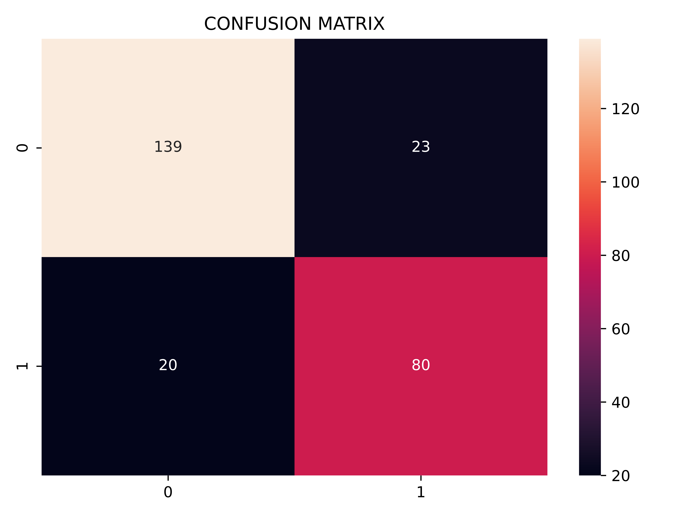

# Titanic Survival Prediction

## Overview

A machine learning project to predict passenger survival on the Titanic. The project compares seven classification algorithms-Decision Tree, Logistic Regression, SVM, AdaBoost, Gradient Boosting, Random Forest, and XGBoost-using a clean, modular, leak-free machine learning pipeline with proper preprocessing, feature engineering, class imbalance handling, and hyperparameter tuning before selecting the best-performing model for deployment.

---

## Project Structure

```text
titanic_prediction/
│
├── models/
│   ├── xgboost_model.pkl
│
├── images/
├── pipeline_tree_model.py
├── pipelines.py
├── eda.ipynb
├── decision_tree.ipynb
├── random_forest.ipynb
├── adaboost.ipynb
├── gradient_boosting.ipynb
├── xgboost_model.ipynb
├── logistic_regression.ipynb
├── svm.ipynb
├── app.py
├── requirements.txt
├── print_metric.py
└── README.md
```

---

## Dataset

- **Source:** [Titanic3 Dataset (Kaggle)](https://www.kaggle.com/datasets/vinicius150987/titanic3)
- **Size:** 1,309 passengers
- **Features:** 14
- **Target:** `survived`
  - `0` = Did not survive
  - `1` = Survived
- **Class Distribution:**
  - Not Survived: ~62%
  - Survived: ~38%

---

## Installation

```bash
git clone https://github.com/YugamdeepGoyal/titanic_prediction.git
cd titanic_prediction

python -m venv .venv

# Windows
.venv\Scripts\activate

# macOS/Linux
source .venv/bin/activate

pip install -r requirements.txt
```

---

## Methodology

### 1. Exploratory Data Analysis

Performed extensive exploratory analysis to understand feature distributions, missing values, correlations, and survival trends.

Key observations:

- **Sex** was the strongest predictor of survival.
  - Female survival rate: ~74%
  - Male survival rate: ~19%
- **Passenger class** showed a clear survival hierarchy.
  - First class: ~63%
  - Second class: ~47%
  - Third class: ~24%
- Children had higher survival rates, while elderly passengers had lower survival rates.
- **Fare** contained significant outliers and showed strong relationships with both passenger class and survival.
- Small families survived more frequently than solo travelers or very large families.

Variance Inflation Factor (VIF) analysis identified multicollinearity between `sibsp` and `parch`, leading to the creation of a single `family` feature.

A `ticket_shared` feature (number of passengers sharing a ticket) was also evaluated. Although it produced a VIF of approximately 8.7, it did not improve model performance and was therefore removed.

---

### 2. Feature Engineering

Feature engineering included:

- Extracting passenger titles from names and grouping them into:
  - Mr
  - Mrs
  - Miss
  - Master
  - Rare
- Creating a new feature:
  - `family = sibsp + parch`
- Dropping information unavailable during inference:
  - `boat`
  - `body`
  - `home.dest`
- Dropping additional columns inside preprocessing:
  - `cabin`
  - `name`
  - `ticket`
  - `sibsp`
  - `parch`

Two dedicated preprocessing pipelines were built.

#### Tree-based Pipeline (`pipeline_tree_model.py`)

Used for:

- Decision Tree
- Random Forest
- AdaBoost
- Gradient Boosting
- XGBoost

Characteristics:

- Ordinal encoding
- No feature scaling
- Raw numerical values retained
- No manual binning

Tree-based models naturally discover optimal split thresholds, making manual binning unnecessary.

#### Linear / Distance-based Pipeline (`pipelines.py`)

Used for:

- Logistic Regression
- SVM

Characteristics:

- One-hot encoding
- Standard scaling
- Additional engineered features:
  - Binned age
  - Binned family size

These engineered categorical features help linear models capture nonlinear relationships that tree models learn automatically.

---

### 3. Preprocessing Pipeline

All preprocessing is performed inside cross-validation using `sklearn.Pipeline` and `imblearn.Pipeline`.

This ensures:

- No data leakage
- Consistent preprocessing
- Fully reproducible experiments

---

### 4. Class Imbalance

Class imbalance was handled using **SMOTE**.

SMOTE is applied:

- Only on training folds
- Inside the pipeline
- During cross-validation

This prevents synthetic samples from leaking into validation data.

---

### 5. Hyperparameter Tuning

Hyperparameters were optimized using:

- GridSearchCV
- RandomizedSearchCV

Configuration:

- 5-fold cross-validation
- Evaluation metric: **ROC-AUC**

ROC-AUC was selected because it is threshold-independent and provides a more reliable evaluation than accuracy under moderately imbalanced datasets.

For XGBoost, the optimal hyperparameters were independently verified by repeating the search over an expanded parameter space. The same best parameters were obtained, indicating that the solution was not a boundary artifact.

---

## Model Performance

| Model                 | Test Accuracy | Test ROC-AUC | Test F1 |
|-----------------------|---------------|--------------|---------|
| Decision Tree         | ~0.802         | ~0.867        | ~0.755   |
| Logistic Regression   | ~0.828         | ~0.880        | ~0.785   |
| SVM                   | ~0.832         | ~0.873        | ~0.782   |
| AdaBoost              | ~0.824         | ~0.893        | ~0.776   |
| Gradient Boosting     | ~0.809         | ~0.898        | ~0.750   |
| Random Forest         | ~0.821         | ~0.900        | ~0.768   |
| XGBoost (selected)    | ~0.836         | ~0.911        | ~0.788   |

---

## Model Selection

XGBoost was selected as the final model because it achieved:

- Highest test ROC-AUC: **~0.9105**
- Highest test F1-score: **~0.788**
- Highest test accuracy: **~0.836**
- Smallest train-test performance gap
---

## Confusion Matrix (XGBoost)


---

>> The model XGBoost is used in streamlit


---

## Technologies Used

- Python
- Pandas
- NumPy
- Scikit-learn
- XGBoost
- Imbalanced-learn (SMOTE)
- Matplotlib
- Seaborn
- Streamlit
- Joblib

---

## Future Improvements

- Probability calibration
- SHAP explainability
- Automated feature selection
- Docker containerization
- CI/CD pipeline
- Cloud deployment

---

## License

MIT License is added in this project.

This project is intended for educational purposes and portfolio demonstration.

---

## Acknowledgements

- Kaggle Titanic3 Dataset
- Scikit-learn Documentation
- XGBoost Documentation
- Streamlit Documentation

---

> This project was developed to practice leak-free machine learning pipeline design, feature engineering, model comparison, hyperparameter optimization, and deployment. It is intended for educational purposes and not for production use.